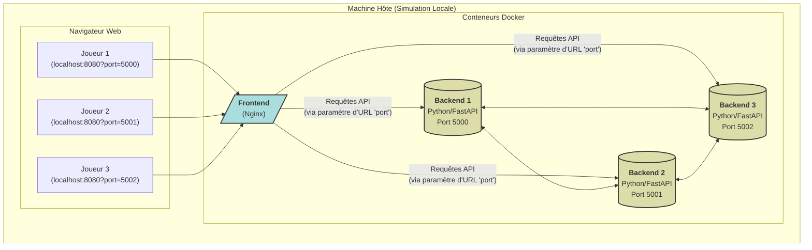
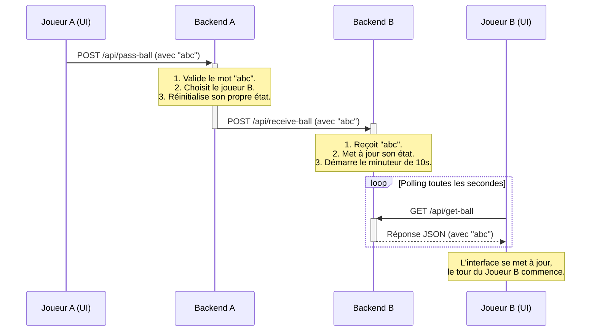

# NetWord Ping Pong

NetWord Ping Pong est un jeu de mots multijoueur en temps réel conçu pour être joué sur un réseau local. Chaque joueur lance une instance de l'application, et les joueurs se "renvoient" une séquence de lettres qui s'allonge à chaque tour, un peu comme une partie de ping-pong verbal.

Le projet est entièrement conteneurisé avec Docker, utilisant une architecture de microservices avec un frontend en JavaScript et un backend en Python (FastAPI).

## 📜 Règles du Jeu

L'objectif est de continuer la séquence de lettres sans se tromper et sans dépasser le temps imparti.

1.  **Démarrage** : N'importe quel joueur peut commencer une partie en cliquant sur le bouton "Commencer une nouvelle partie".
2.  **La Balle** : Une "balle" (une séquence de lettres) est envoyée à un joueur choisi au hasard. La première balle est une seule lettre (par exemple, "a").
3.  **Le Tour** : Le joueur qui reçoit la balle a **10 secondes** (configurable dans le code backend) pour ajouter une seule lettre à la fin de la séquence et la renvoyer.
    ◦   *Exemple* : S'il reçoit "ab", il doit taper "abc" (ou "abd", "abe", etc.).
4.  **Le Passe** : Une fois le mot renvoyé, la nouvelle séquence est envoyée à un autre joueur au hasard. Le système essaie de choisir équitablement les joueurs qui ont eu le moins de tours.
5.  **Défaite** : Si un joueur ne renvoie pas le mot dans le temps imparti, il a perdu. Le jeu est alors réinitialisé pour tous les participants.
6.  **Mode Solo** : Le jeu est entièrement jouable en solo. Dans ce cas, le joueur se renverra la balle à lui-même.

## 🏗️ Architecture Technique

Le projet utilise une architecture de microservices orchestrée par Docker Compose. Cela permet de simuler plusieurs joueurs sur une seule machine ou de déployer facilement le jeu sur plusieurs machines du réseau.



**Composants**
*   **Frontend** : Une application statique (HTML, CSS, JavaScript) servie par un conteneur Nginx. Elle fournit l'interface utilisateur et communique avec une instance backend spécifique via des appels API REST.
*   **Backend** : Un serveur Python FastAPI qui gère la logique et l'état du jeu pour un joueur. Chaque instance backend représente un joueur sur le réseau et peut communiquer avec les autres instances.
*   **Docker Compose** : Le chef d'orchestre. Il définit, construit et lance tous les conteneurs, gère le réseau virtuel entre eux et injecte les variables d'environnement nécessaires (comme l'adresse IP et le port).

## 🔄 Flux d'un Tour de Jeu

Voici la séquence d'événements lorsqu'un joueur renvoie la balle.



## 🚀 Comment Lancer le Projet

### Prérequis
*   Docker
*   Docker Compose (généralement inclus avec Docker Desktop)

### Étape 1 : Cloner le Projet
```shell
git clone <URL_DU_PROJET>
cd NetWordPingPong
```

### Étape 2 : Configurer l'Adresse IP

Ouvrez le fichier `docker-compose.yml`. Vous devez y indiquer l'adresse IP de la machine qui héberge les conteneurs.

1.  **Trouvez votre IP locale** :
    *   Linux/macOS : `hostname -I`
    *   Windows (PowerShell) : `(Get-NetIPAddress -InterfaceAlias 'Wi-Fi' -AddressFamily IPv4).IPAddress` (adaptez 'Wi-Fi' si besoin).

2.  **Modifiez le fichier** : Remplacez `192.168.1.140` par votre propre IP locale.
    ```yaml
    # ...
    services:
      backend:
        # ...
        environment:
          # ====================================================================
          # MODIFICATION MANUELLE REQUISE
          # Remplacez "192.168.1.140" par l'adresse IP de votre machine
          # sur le réseau local.
          # ====================================================================
          - OWN_HOST=192.168.1.140 # <-- MODIFIEZ CETTE LIGNE
          - OWN_PORT=5000
    # ...
    ```

### Étape 3 : Lancer l'Application

Ouvrez un terminal à la racine du projet et exécutez :
```shell
docker-compose up --build
```
Cette commande va construire les images Docker et démarrer les conteneurs du frontend et du backend.

### Étape 4 : Jouer !

1.  Ouvrez votre navigateur et allez sur **`http://localhost:8080`**.
2.  Le jeu va automatiquement lancer une recherche réseau pour trouver d'autres joueurs (d'autres instances du backend sur le réseau).
3.  Sur n'importe quelle page, cliquez sur **"Commencer une nouvelle partie"** pour lancer la première balle !

*Note : Pour simuler plusieurs joueurs sur une seule machine, vous devrez adapter le `docker-compose.yml` pour lancer plusieurs services backend sur des ports différents (5001, 5002, etc.) et ouvrir des onglets de navigateur correspondants.*

## ⚙️ Points d'API du Backend

Chaque instance backend expose les endpoints suivants :

*   `POST /api/discover` : Déclenche un scan du réseau pour trouver d'autres joueurs.
*   `POST /api/register` : Permet à un autre joueur de s'enregistrer sur cette instance.
*   `POST /api/start-game` : Démarre une nouvelle partie en envoyant la première balle.
*   `POST /api/pass-ball` : Reçoit le mot complété d'un joueur, le valide, et le passe au joueur suivant.
*   `POST /api/receive-ball` : Reçoit la balle d'un autre joueur et démarre le tour.
*   `GET /api/get-ball` : Permet au frontend de vérifier si c'est son tour de jouer.
*   `POST /api/game-over` : Informe l'instance qu'un joueur a perdu et que le jeu doit être réinitialisé.